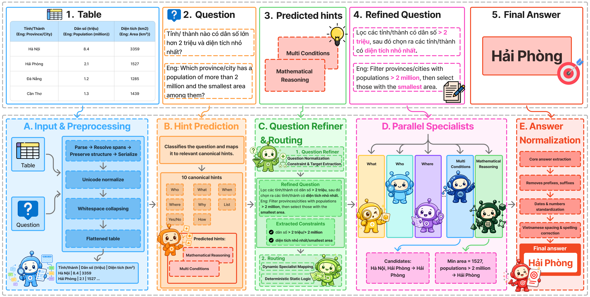

# POMA

**Parallel Multi-Agent Orchestration for Vietnamese Table Question Answering**

POMA is an inference-time, prompt-based multi-agent framework for answering Vietnamese questions over semi-structured tables. It is evaluated on [Open-ViTabQA](dataset/README.md), where tables can contain multi-level headers and merged cells, questions may require multi-step reasoning, and unsupported questions must be answered with the literal `Null`.

Rather than asking one LLM call to interpret the question, find evidence, reason over the table, decide answerability, and format an answer, POMA decomposes the workflow into controllable stages. It does not fine-tune the backbone model.

> **Reported result:** on the Open-ViTabQA test split, POMA with Qwen3 8B achieves **80.24 EM**, **88.23 F1**, **86.07 ROUGE-1**, and **84.50 METEOR**.

## Architecture



```text
Vietnamese question + HTML table
            |
            v
  Flatten V1 table representation
            |
            v
      Hint prediction
            |
            v
   Question refinement
            |
            v
 Deterministic hint-based router
            |
            v
 Parallel specialist agents
            |
            v
    Answer normalization
            |
            v
 Candidate answers / Null
```

The router operates on a fixed, interpretable hint vocabulary:

`What`, `Where`, `Who`, `When`, `Why`, `How`, `YesNo`, `List`, `MathematicalReasoning`, and `MultiConditions`.

Each selected specialist returns an answer candidate, evidence, confidence, and a short rationale. The normalization stage then creates evaluation-ready Vietnamese answer variants for booleans, numbers, dates, lists, ranks, and `Null` cases.

## Repository layout

```text
POMA/
├── dataset/           # Open-ViTabQA train/dev/test questions and 329 tables
├── preprocessing/     # HTML parser and Flatten V1 representation
├── src/
│   ├── agents/        # hint predictor, refiner, router, normalizer, specialists
│   ├── orchestration/ # pipeline and parallel executor
│   ├── prompts/       # prompt templates
│   └── services/      # LLM client integration
├── baseline/          # direct-prompting baselines
├── evaluation/        # EM, F1, ROUGE-1, METEOR, and diagnostic metrics
├── outputs/           # generated predictions, traces, and reports
├── run_poma.py        # POMA runner
├── run_baseline.py    # baseline runner
└── run_eval.py        # standalone evaluator
```

## Installation

POMA requires Python >= 3.9.

```bash
git clone https://github.com/NgDinhKhoi0709/POMA.git
cd POMA

python -m venv .venv
```

Activate the environment, then install the runtime dependencies:

```bash
# Windows PowerShell
.\.venv\Scripts\Activate.ps1

pip install openai requests beautifulsoup4 python-dotenv
```

The project supports OpenAI and OpenRouter model endpoints. Configure at least one provider in a local `.env` file; do not commit this file.

```dotenv
# OpenAI (one key or a comma-separated list)
OPENAI_API_KEY=your_openai_key

# OpenRouter (one key or a comma-separated list)
OPENROUTER_API_KEY=your_openrouter_key
```

For key rotation, the client also accepts `GPT_API_KEY`, `GPT_API_KEYS`, `GPT_API_KEY_1` ... `GPT_API_KEY_50`, `OPENROUTER_API_KEYS`, and `OPENROUTER_API_KEY_1` ... `OPENROUTER_API_KEY_50`.

## Quick start

Run a small POMA smoke test using the test split:

```bash
python run_poma.py \
  --model qwen3-8b \
  --limit 5 \
  --output outputs/poma/smoke.json
```

By default, batch runs predict hints with `HintPredictorAgent`, write a per-question trace beside the result file, and run evaluation after completion. Use `--no-eval` or `--no-traces` to disable either output.

Run the full test split:

```bash
python run_poma.py \
  --qas dataset/qas_test.json \
  --tables dataset/table.json \
  --model qwen3-8b \
  --output outputs/poma/qwen3-8b-test.json
```

The model argument accepts aliases such as `qwen3-8b` and `llama-3.1-8b-it`, or a full provider-qualified ID such as `openai/gpt-4o-mini` or `openrouter/qwen/qwen3-8b`.

### Reproduce or inspect individual stages

Use the annotated dataset hints instead of runtime hint prediction:

```bash
python run_poma.py --use-dataset-hints --limit 5
```

Reuse the trace saved by a prior run and rerun only a later stage (keep the same output path):

```bash
python run_poma.py \
  --stages normalization \
  --output outputs/poma/qwen3-8b-test.json
```

Use precomputed hint predictions without calling the hint predictor:

```bash
python run_poma.py \
  --hint-predictions path/to/hint_predictions.json \
  --output outputs/poma/predictions.json
```

Interactive mode is available for manual inspection:

```bash
python run_poma.py --interactive --model qwen3-8b
```

## Baselines

The baseline runner evaluates a single LLM prompt over the same Flatten V1 table representation. It supports `zero_shot`, `cot`, `task_decomposition`, and `few_shot` prompt styles.

```bash
python run_baseline.py \
  --models qwen3-8b \
  --prompt-style zero_shot \
  --limit 5 \
  --output_dir outputs/baseline \
  --id qwen3-8b-zero-shot
```

## Evaluation

POMA evaluates candidate answer lists against the reference answer and selects the best matching candidate. The default metrics are F1, Exact Match, ROUGE-1, and METEOR.

```bash
python run_eval.py \
  --pred outputs/poma/qwen3-8b-test.json \
  --qas dataset/qas_test.json \
  --output outputs/poma/qwen3-8b-test-eval.json
```

For answerability, question-type, and table-structure diagnostics, use the standalone evaluator:

```bash
python run_eval.py \
  --pred outputs/poma/qwen3-8b-test.json \
  --qas dataset/qas_test.json \
  --metrics f1,em,rouge1,meteor,answerability_f1,rouge1_by_hint,metrics_by_table_type \
  --tables dataset/table.json
```

`metrics_by_table_type` requires `--tables`; it reports performance across normal tables, merged-header tables, and merged-value tables.

## Dataset

The repository includes Open-ViTabQA:

| File | Records | Purpose |
| --- | ---: | --- |
| `dataset/qas_train.json` | 7,928 | Training split |
| `dataset/qas_dev.json` | 991 | Development split |
| `dataset/qas_test.json` | 992 | Test split |
| `dataset/table.json` | 329 | Source Wikipedia tables |

Each QA record contains `qa_id`, `table_id`, `question`, `answer`, and `hints`. Each table record stores HTML, title, domain, table type, and a flattened table dictionary. See the [dataset documentation](dataset/README.md) for the data schema.

## Results

The following values are reported in the accompanying paper for Open-ViTabQA test data. All metrics are percentages.

| System | EM | F1 | R1 | MET |
| --- | ---: | ---: | ---: | ---: |
| Qwen3 8B zero-shot | 62.40 | 76.16 | 69.06 | 67.52 |
| Qwen3 8B task decomposition | 59.38 | 74.01 | 65.99 | 64.15 |
| Qwen3 8B chain-of-thought | 59.17 | 74.03 | 66.55 | 64.45 |
| Qwen3 8B few-shot | 67.14 | 78.64 | 74.18 | 72.30 |
| **POMA (Qwen3 8B)** | **80.24** | **88.23** | **86.07** | **84.50** |

## Citation

The manuscript has been submitted to *Knowledge and Information Systems* and is currently under review. Until a final bibliographic record is available, please cite it as an unpublished manuscript:

```bibtex
@unpublished{nguyen2026poma,
  title   = {POMA: A Parallel Multi-Agent Orchestration for Vietnamese Table Question Answering},
  author  = {Nguyen, Dinh Khoi and Dang, Van Thin},
  note    = {Under review at Knowledge and Information Systems},
  year    = {2026}
}
```

## References

- POMA is built for the [Open-ViTabQA](dataset/README.md) benchmark included in this repository.
- [GLiNER2](https://github.com/fastino-ai/GLiNER2) informed the concise research-software documentation structure used here. POMA does not depend on GLiNER2.

## License

No license file is currently included. Contact the authors before redistributing or reusing the code and data outside the scope of the associated research.
