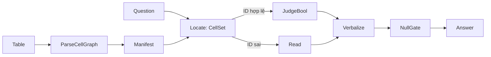

# Đề xuất: GaP-TQA — Graph-as-Policy theo lớp câu hỏi cho Open-ViTabQA

Ngày: 2026-09-22. Đầu vào: [GaP, arXiv:2607.05369](2607.05369v1.pdf) và bản nháp
[`proposal_gap_poma.pdf`](proposal_gap_poma.pdf) (Typed Multi-Agent Graph Orchestration).
Số liệu mới trong tài liệu này đo bằng [`scripts/census_graph_reach.py`](../../../scripts/census_graph_reach.py)
trên artifact có sẵn, **không gọi API**; kết quả lưu ở `outputs/graph_census/census.json`.

## Tóm tắt

**Hệ đề xuất: GaP-TQA.** Mỗi lớp câu hỏi (Yes/No, What, kết hợp ô, ...) có **một graph có kiểu
cố định**. Graph ghép node tất định (dựng lưới ô span-aware, manifest cấu trúc, chuyển từ Yes/No,
chính sách độ chi tiết, bỏ phiếu, cổng `Null`) với node lá do Qwen3-8B thực hiện (định vị ID ô,
trích đoạn, phán đoán Bool). Graph được sinh và tinh chỉnh **ngoại tuyến** trên train bằng vòng
rehearse → quy lỗi về node → sửa một node → nhận/từ chối trên dev, rồi **đóng băng**. Ở test,
một interpreter tất định chạy graph với 1–3 lệnh gọi 8B mỗi câu, không có agent nào ở runtime.
Đây là cách chuyển GaP sát nguyên bản nhất: GaP cũng học một graph cho một *lớp* tác vụ rồi chạy
nó trên robot mà không cần agent.

Hình dạng này do bốn phát hiện quyết định:

1. **Headroom nằm ở bước phát đáp án, không nằm ở phép tính.** Một node tất định chuyển đáp án
   Yes/No theo đuôi câu hỏi, luật lấy từ train, nâng FS+GSA **70,16 → 73,29 EM (+3,13; KTC 95%
   ghép cặp [+1,92; +4,33]; 34 thắng / 3 thua)**, lớn hơn mọi direction D01–D13. Trong 265 lỗi
   còn lại, 96 là lỗi độ chi tiết/định dạng, 45 là nhầm `Null`, chỉ 90 là lỗi thực chất.
2. **Graph không nên do 8B viết cho từng câu.** Thư viện thao tác ở Bảng 4.1 của bản nháp gần như
   trùng DSL của `src/table_executor/ast_executor.py` (D04). D04 đã chạy: cổng kích hoạt 11/200
   câu, cả 11 câu reader đã đúng, 0 thắng / 2 thua; 18,5% plan hỏng JSON. Chỉ **3,0%** gold test
   là số phải tính ra.
3. **Tự học của GaP chuyển được nếu ánh xạ đúng tầng.** Bản nháp (mục 2.1) kết luận vòng tự học
   không chuyển được vì test không có gold. Nhưng GaP không sinh graph cho từng instance: lớp tác
   vụ ↔ lớp câu hỏi, instance ↔ câu hỏi của train, predicate thành công ↔ EM với gold train.
   Test không cần gold, giống robot thật không cần simulator.
4. **Không có gì để chia cho multi-agent ở runtime.** Chỉ **9,0%** câu test (10,1% train) có ≥ 2
   nhãn hint. Multi-agent đặt ở **harness sinh graph ngoại tuyến** (như GaP dùng Claude/Gemini),
   không đặt trong vòng suy luận của model 8B.

## 1. Số liệu chặn mọi thiết kế

### 1.1 Dạng đáp án gold

Phân loại tất định từng đáp án gold so với các ô của bảng (`gold_kind` trong script):

| Dạng gold | Test (n=992) | Train (n=7.928) | Graph thao tác biểu diễn được? |
|---|---:|---:|---|
| Ô nguyên văn (`cell`) | 436 (44,0%) | 41,8% | Có: Locate → Emit |
| Yes/No | 191 (19,3%) | 19,6% | Có: Compare/JudgeBool → Verbalize |
| Đoạn nằm trong ô (`span_in_cell`) | 103 (10,4%) | 9,6% | Một phần: cần node LLM ExtractSpan |
| Văn bản tự do | 70 (7,1%) | 7,1% | Không |
| Số có trong bảng | 51 (5,1%) | 5,4% | Có |
| Nhiều ô (liệt kê) | 50 (5,0%) | 5,4% | Có |
| `Null` | 45 (4,5%) | 4,4% | Cổng riêng |
| Số suy ra (không có trong bảng) | 30 (3,0%) | 4,7% | Có: Aggregate. **Đây là toàn bộ vùng của D04** |
| Nhiều đoạn | 16 (1,6%) | 2,2% | Không |

Độ phủ lý thuyết của graph có kiểu là **76,4%** (test) và 76,8% (train). Nhưng phần tính toán
thật chỉ **3,0%** câu test, khớp với việc D04 không tìm thấy chỗ để sửa. Graph có giá trị nếu nó
**định vị ô và phát đáp án đúng dạng**, không phải nếu nó tính toán.

### 1.2 Lỗi của hệ mạnh nhất nằm ở đâu

Hệ mạnh nhất trong repo là **FS+GSA (70,16 EM)**, không phải POMA+GSA (68,45). Bản nháp đặt
POMA làm đối chứng; một reviewer Q2 sẽ bắt lỗi này ngay.

Lỗi của FS+GSA (296 câu) theo dạng gold: Yes/No 65, văn bản tự do 65, ô 60, đoạn trong ô 50,
nhiều ô 16, số suy ra 14, số trong bảng 11, `Null` 10, nhiều đoạn 5.

Soi các câu sai cho thấy phần lớn **không phải lỗi suy luận**:

- **Yes/No sai 65 câu, trong đó khoảng 46 câu đúng cực tính nhưng sai từ.** Gold là `Đúng` hoặc
  `Phải`, model trả `Có`. Trên train, gold phụ thuộc gần tất định vào đuôi câu hỏi: `...đúng không?`
  → `Đúng` 273 / `Có` 66; `...phải không?` → `Phải` 103 / `Đúng` 46; đuôi `...không?` khác → `Có`
  306; mọi câu phủ định → `Không`.
- **Văn bản tự do sai 65/70 câu**, phần lớn do độ chi tiết: gold `Năm 1709` và đáp án `1709`;
  gold `2 năm` và đáp án `2`; gold `23 (UHF/VHF)` và đáp án `23`; gold `14,84 km2.` và đáp án `14.84`.
- **Ô sai 60 câu**, phân bố đều trên 4 tầng `table_type` (normal 18, merged_header 15, cả hai 14,
  merged_value 13). Có cả lỗi độ chi tiết (gold `7`, đáp án `Tháng 7`) lẫn lỗi định vị thật
  (gold `Pilot`, đáp án là danh sách số tập).

### 1.3 Thí nghiệm miễn phí: node Verbalize Yes/No

Luật lấy từ train: nếu đáp án thuộc {có, không, đúng, sai, phải, không phải}
thì câu phủ định → `Không` (hoặc `Sai` với `đúng hay sai`); câu khẳng định → `Đúng` nếu đuôi
`đúng không`/`đúng hay sai`, `Phải` nếu đuôi `phải không`, còn lại `Có`.

Nguồn gốc luật cần nói rõ: dạng luật được nghĩ ra sau khi thấy danh sách lỗi Yes/No trên test,
còn bảng từ vựng lấy từ train. Để kiểm tra luật có bị khớp theo test không, cho luật nhận cực tính
gold rồi đo tỉ lệ tái tạo đúng nguyên chuỗi gold trên từng split: **train 90,1% (n=1.552), dev
87,6% (n=194), test 91,6% (n=191)**, so với 69,8% / 69,6% / 70,7% nếu luôn trả `Có`/`Không`.
Test không cao bất thường so với train và dev, nên luật không bị khớp theo test.

| Reader | EM gốc | + Verbalize | Hiệu (KTC 95% ghép cặp) | Thắng / thua |
|---|---:|---:|---|---:|
| Few-shot | 67,34 | 70,26 | +2,92 [+1,81; +4,13] | 32 / 3 |
| **Few-shot + GSA** | **70,16** | **73,29** | **+3,13 [+1,92; +4,33]** | 34 / 3 |
| POMA + GSA | 68,45 | 71,77 | +3,33 [+2,12; +4,54] | 36 / 3 |

Hai điều rút ra. Thứ nhất, **đối chứng mới phải là FS+GSA+Verbalize = 73,29**: node này không
phụ thuộc kiến trúc, nên hệ graph không được tính phần này là đóng góp của mình. Thứ hai, đây
chính là loại node mà GaP gọi là "model-based procedure": rẻ, tất định, học được tham số trên
train. Nó chứng minh vòng lặp "tinh chỉnh node trên train, đóng băng, chạy test" có tác dụng
trên dataset này, ít nhất với một node.

Sau Verbalize, 265 lỗi còn lại của FS+GSA chia thành: **thực chất 90**, lỗi chuỗi con/chuỗi cha
(độ chi tiết) **84**, nhầm `Null` **45**, Yes/No chưa khớp **34** (gồm cả sai cực tính thật và
câu model không trả Yes/No), cùng số khác định dạng **12**. Trần lý thuyết từ đây là ≈ 26,7 điểm.
Nhóm độ chi tiết và định dạng (96 câu) **chưa chắc node tất định xử lý được**: lỗi đi theo cả hai
chiều (gold `Năm 1709` dài hơn đáp án `1709`; gold `7` ngắn hơn đáp án `Tháng 7`). Node
`Granularity` chỉ có ích nếu chiều này đoán được từ lớp câu hỏi hoặc từ câu hỏi; **cần đo** trên
dev ở G0 trước khi tính vào headroom.

### 1.4 Bỏ phiếu và neo vào bảng

Chọn đáp án bằng bỏ phiếu trên 6 artifact có sẵn (ZS, CoT, FS, POMA-first, POMA+GSA, FS+GSA),
hoà thì ưu tiên FS+GSA:

- Vote: **71,47 EM, +1,31 [+0,10; +2,52]** so với FS+GSA, 26 thắng / 13 thua.
- Vote + ưu tiên đáp án neo được vào ô: 71,57, +1,41 [+0,10; +2,72]. **Phần neo gần như không
  thêm gì** (+0,1).
- Oracle-of-6: **80,14 EM**. Khoảng cách 10 điểm tới FS+GSA cho thấy cần một node chọn đáp án
  tốt, nhưng neo vào bảng một cách tất định chưa phải node đó.

Cả hai số này là **phân tích hậu nghiệm trên test**, chỉ để định hướng, và phải xác nhận lại
trên dev.

## 2. Ánh xạ GaP → Table QA, sửa lại

| GaP | Bản nháp `proposal_gap_poma` | **GaP-TQA (đề xuất này)** |
|---|---|---|
| Lớp tác vụ VA (ví dụ Make Popcorn) | Từng câu hỏi | **Lớp câu hỏi** (10 nhãn hint, có thể tách nhỏ theo dạng gold) |
| Instance lấy từ belief space B | — | Câu hỏi + bảng của train/dev thuộc lớp đó |
| Predicate thành công định nghĩa sẵn | Không có ở test, nên loại bỏ | **EM với gold của train** (tự động, không cần nhãn mới) |
| MORSL: node model-based + model-free | 9 node thao tác tất định | **TMSL**: node tất định + node LLM 8B (mục 3) |
| Orchestration + Skill Agent | Chạy ở runtime, 8B | **Chạy ngoại tuyến**, model mạnh làm harness |
| Graph validation tĩnh | Mệnh đề 4.1 | Giữ nguyên: kiểm kiểu và cạnh trước khi rehearse |
| Rehearsal song song + sửa có mục tiêu | Chỉ ở train, sinh lại theo từng câu | **Rehearse graph của lớp trên N câu train, sửa một node/tham số mỗi vòng** |
| Graph G* chạy trên edge không cần agent | Sinh graph 1 lần/câu ở test | **Interpreter tất định + Qwen3-8B ở node lá; 1–3 lệnh gọi/câu** |

Điểm khác cốt lõi so với bản nháp: **graph là chính sách của một lớp câu hỏi, không phải chương
trình của một câu hỏi.** Model 8B không bao giờ phải viết graph; nó chỉ điền vào node lá (định vị
ô, trích đoạn, phán đoán Bool). Điều này né cả ba bằng chứng âm đã có: 18,5% `parse_error` khi
8B viết JSON AST (D04), sụp đổ của suy luận symbolic ở model nhỏ (Mix-SC, ASTRA), và sycophancy
của nhiều persona trên cùng backbone 8B (tài liệu 2026-09-18).

## 3. Thư viện node có kiểu (TMSL)

Kiểu: `Table`, `CellGraph`, `CellSet`, `Span`, `Scalar`, `Bool`, `Text`, `Candidates`, `Answer`.

| Node | Loại | Chữ ký | Nguồn gốc / bằng chứng |
|---|---|---|---|
| `ParseCellGraph` | Tất định | Table → CellGraph | Lưới span-aware từ HTML (rowspan/colspan), mỗi ô có đường dẫn header hàng và cột. 53,5% bảng test có merge |
| `Manifest` | Tất định | CellGraph → Text | Manifest cấu trúc 100–300 token (tài liệu 2026-09-18, Trục 3) |
| `ReduceRows` | Tất định | CellGraph × Text → CellGraph | H1 BM25 (D10); chỉ bật với bảng > 2.000 token |
| `Read` | LLM 8B | CellGraph × Text → Text | Reader few-shot hiện có |
| `Locate` | LLM 8B | CellGraph × Text → CellSet | Xuất **ID ô** trên CellGraph, không xuất chữ; ID sai thì fallback sang `Read` |
| `ExtractSpan` | LLM 8B | CellSet × Text → Span | Cho 10,4% gold là đoạn trong ô |
| `JudgeBool` | LLM 8B | CellSet × Text → Bool | Phán đoán Yes/No trên ô đã định vị |
| `Aggregate` | Tất định | CellSet → Scalar | Tái dùng `ast_executor` (D04), **chỉ làm node tùy chọn** |
| `Vote` | Tất định | Candidates → Answer | +1,31 EM hậu nghiệm (mục 1.4) |
| `Verbalize` | Tất định, tham số học từ train | Bool × Text → Answer | **+3,13 EM** (mục 1.3) |
| `Granularity` | Tất định, tham số học từ train | CellSet × Span × Text → Answer | Chọn phát nguyên ô, đoạn tối thiểu hay kèm đơn vị. Nhắm 84 + 12 lỗi |
| `NullGate` | Tất định/LLM | Answer × CellGraph → Answer | Nhắm 45 lỗi `Null`. Chú ý D11: cổng hai bước cứu 5 câu, phá 4 câu |
| `Explain` | LLM 8B | CellSet × Text → Text | Why/How (40/992 câu); không kỳ vọng graph giúp được |

**Bỏ `Join`** trong Bảng 4.1 của bản nháp: mỗi câu Open-ViTabQA gắn đúng một `table_id`, nên
không có bảng thứ hai. `GroupBy` và `Sort` giữ trong `Aggregate` của D04.

Graph khởi đầu cho một lớp, ví dụ Yes/No:



## 4. Vòng tự học ngoại tuyến (thay cho Algorithm 1 của bản nháp)

Với mỗi lớp câu hỏi c:

1. **Khởi tạo.** Harness (model mạnh, chạy ngoại tuyến) đọc mô tả lớp, TMSL và 10 ví dụ train,
   rồi sinh graph G₀(c). Kiểm kiểu và cạnh tĩnh (Mệnh đề 4.1 của bản nháp giữ nguyên).
2. **Rehearse.** Chạy G_j(c) bằng interpreter + Qwen3-8B trên N = 100 câu train của lớp c. Ghi
   **vết từng node** (ô định vị, span, Bool, đáp án trước và sau mỗi node tất định).
3. **Quy lỗi về node.** So với gold, gán mỗi câu sai cho node đầu tiên lệch khỏi gold: ô gold
   không nằm trong CellSet thì lỗi ở `Locate`; đáp án chứa gold hoặc ngược lại thì lỗi ở
   `Granularity`; và tương tự. Không cần LLM cho bước này ở phần lớn trường hợp.
4. **Sửa có mục tiêu.** Harness đề xuất **một** chỉnh sửa trên node chịu nhiều lỗi nhất, từ tập
   chỉnh sửa đóng: đổi node, đổi tham số (luật Verbalize, chính sách Granularity, k của
   ReduceRows), đổi few-shot của node LLM, chèn hoặc bỏ một node tất định.
5. **Nhận hoặc từ chối.** Chạy G_{j+1}(c) trên một minibatch dev của lớp c; nhận chỉnh sửa khi hiệu
   ghép cặp dương và số thua không vượt ngưỡng chốt trước. Lặp tối đa M = 5 vòng. Không dùng
   tiêu chí "plateau" mơ hồ.
6. **Đóng băng** G*(c). Test chỉ chạy G*(c) một lần.

Ở test, lớp c lấy từ **Hint Predictor hiện có của POMA**, không lấy từ trường `hints` gold của
dataset. Sai lớp thì graph sai được chạy, nên G5 phải báo cáo thêm nhánh dùng hint gold để tách
lỗi của Hint Predictor khỏi lỗi của graph.

Khác GaP: predicate thành công là EM với gold chứ không phải trạng thái vật lý. Khác bản nháp:
thứ được học là **một graph cho cả lớp**, nên chi phí học chia đều cho mọi câu test và test không
cần gold.

## 5. Thí nghiệm, có cổng dừng

Quy ước chung cho mọi thí nghiệm: backbone `qwen/qwen3-8b` qua OpenRouter (provider Alibaba),
scorer `run_eval.py --strict` một đáp án, KTC 95% bootstrap ghép cặp 10.000 mẫu, McNemar exact,
báo cáo theo **4 tầng `table_type`**, cộng tổng token và số lệnh gọi. **Chọn mọi thứ trên
train/dev; test chạy một lần.** Đối chứng chính: **FS+GSA+Verbalize**.

| # | Thí nghiệm | Câu hỏi | Cổng dừng | Chi phí |
|---|---|---|---|---|
| **G0** | Chạy FS và FS+GSA trên dev; áp Verbalize và Vote | Hai node tất định có giữ hiệu ứng trên dev không? | Verbalize < +1,5 trên dev → xem lại luật; không ảnh hưởng G1+ | ≈ $1 |
| **G1** | `Locate` trên CellGraph, 200 câu dev loại `cell` | 8B định vị ID ô đúng bao nhiêu? Có tốt hơn trên bảng merge không? | Độ chính xác ô < 70% → dừng hướng `Locate`, graph chỉ còn node tất định | ≈ $0,5 |
| **G2** | Graph tay (không tự học) cho 3 lớp lớn nhất: Yes/No, What, kết hợp ô | Cấu trúc graph có hơn FS+GSA+Verbalize không? | Không thắng trên dev → trục tự học không đáng làm | ≈ $2 |
| **G3** | Vòng tự học mục 4 cho cả 10 lớp | Tự học có hơn graph tay G2 không? (tương ứng RQ3 của bản nháp) | — | ≈ $5–10 |
| **G4** | Ablation: harness 1 agent so với Orchestration + Skill Agent | RQ2 của bản nháp, dời sang tầng harness | — | ≈ $2 |
| **G5** | Test 992 câu một lần: G*(c) so với FS+GSA+Verbalize | Kết quả chính | — | ≈ $1–2 |

Tổng ≈ **$12–18**, thấp hơn ước tính $25–40 của bản nháp, vì graph học một lần cho mỗi lớp thay
vì sinh lại cho từng câu, và runtime chỉ 1–3 lệnh gọi 8B mỗi câu.

Việc bắt buộc trước G1: dùng `response_format` (JSON schema) cho mọi node LLM
(`src/contracts/structured_outputs.py`). D04 mất 18,5% plan vì JSON hỏng, và 31/37 lỗi là
ngoặc không cân. `Locate` xuất ID ô nên schema rất nhỏ.

**Độ phân giải.** Với tỉ lệ bất đồng d ≈ 0,08, MDE ghép cặp ≈ 2,5 điểm. Hiệu ứng mục tiêu hợp lý
của G5 so với đối chứng là +2 đến +4 điểm, vừa đủ đo được. Phải nói điều này trước, vì bộ test
992 câu không phân giải được hiệu ứng dưới khoảng 2,5 điểm.

## 6. Tính mới và rủi ro trùng lặp

| Công trình | Trùng ở đâu | Khác ở đâu |
|---|---|---|
| GaP (2607.05369) | Graph-as-policy theo lớp tác vụ, rehearse và sửa có mục tiêu | Robot, simulator; ở đây là table QA, predicate là gold train |
| **AFlow** (2410.10762, ICLR 2025), **GPTSwarm** (ICML 2024), MaAS, FlowBank (2606.11290), JudgeFlow (2601.07477) | **Rủi ro lớn nhất**: tối ưu workflow dạng graph trên tập validation bằng phản hồi thực thi | Các hệ đó tối ưu một workflow cho cả benchmark bằng operator chung (Generate, Review, Ensemble); ở đây graph **có kiểu trên cấu trúc bảng** (ID ô, đường dẫn header), **mỗi lớp câu hỏi một graph**, và lỗi được **quy về node bằng vết tất định**. JudgeFlow cũng quy lỗi theo khối nhưng dùng LLM judge |
| A.DOT (2603.14229, IBM, HybridQA, Llama-3-70B; đã xác minh, venue chưa rõ) | DAG có kiểu + validator tách biệt | Một LLM 70B sinh DAG cho từng câu; không học ngoại tuyến |
| SQLizer (OOPSLA 2017) | Type-check thao tác trên bảng | Một synthesizer, sinh theo từng câu |
| Chain-of-Table, Binder, Dater | Thao tác bảng có cấu trúc | Sinh theo từng câu, không có kiểu, model lớn |
| D04 trong repo | DSL thao tác có kiểu | Đã âm; ở đây Aggregate chỉ là một node tùy chọn |

Claim trung thực có thể đứng được: *graph có kiểu theo lớp câu hỏi, học ngoại tuyến bằng quy lỗi
theo node trên cấu trúc bảng, cho phép model dưới 10B chạy với 1–3 lệnh gọi mỗi câu.* Claim
"multi-agent sinh subgraph ghép thành DAG là trục mới" của bản nháp **không nên giữ**: vừa bị
AFlow/GPTSwarm/MaAS che, vừa không có dữ liệu để phân mảnh (9% câu ≥ 2 đoạn).

## 7. Rủi ro

- **Phần lớn lợi ích có thể là node tất định.** Nếu G2/G3 chỉ thắng nhờ Verbalize, Granularity
  và Vote, reviewer sẽ gọi đây là hậu xử lý. Cách chống: đối chứng là FS+GSA **đã có** các node
  tất định đó, và báo cáo phần đóng góp của `Locate` tách riêng (độ chính xác ô, đo ở G1).
- **Luật học từ gold train phụ thuộc cách gán nhãn của dataset.** Verbalize học phong cách của
  người gán nhãn Open-ViTabQA. Điều này hợp lệ (học trên train, không chạm test) nhưng phải nói
  rõ trong bài. Mục 4 của tài liệu 2026-09-18 đã cảnh báo loại rule khớp theo answer key của tập
  test; ở đây rule chỉ lấy từ train.
- **Why/How (40/992) và văn bản tự do (7,1%) nằm ngoài tầm graph.** Nói trần này ngay trong bài.
- **Quá khớp theo lớp.** Lớp nhỏ (How 107 câu train) dễ quá khớp; gộp lớp nhỏ vào lớp gần nhất
  hoặc dùng graph mặc định.
- **Phạm vi.** Như bản nháp đã nêu, đây là bài sau (v3), tách khỏi bản revise POMA đang chạy.
  Riêng node Verbalize thì nên đưa ngay vào bản revise, vì nó giúp mọi hệ và đã có số liệu.

## 8. Việc làm ngay

1. Đưa Verbalize vào finalizer (có test, luật lấy từ train). Chạy lại D01 audit để cập nhật bảng
   đối chứng: FS+GSA+Verbalize = 73,29.
2. G0 trên dev để xác nhận Verbalize và Vote không phải hiện tượng riêng của test.
3. G1 (`Locate` trên CellGraph, 200 câu dev), sau khi bật `response_format`. Đây là cổng quyết
   định cả hướng graph.

## Tái lập

```bash
python scripts/census_graph_reach.py --out outputs/graph_census/census.json
```

Script đọc 6 artifact một đáp án ở `outputs/d01/` và `outputs/d04/.../full/`. Node Verbalize ở
mục 1.3 nằm trong script (hàm `verbalize`, khoá `verbalize_*` trong `census.json`); artifact đã
đổi nhãn được ghi ra `outputs/graph_census/*_verbalize.json`. Khi đưa Verbalize vào finalizer
(việc 1 ở mục 8), chạy lại bằng `scripts/audit_d01.py`.
